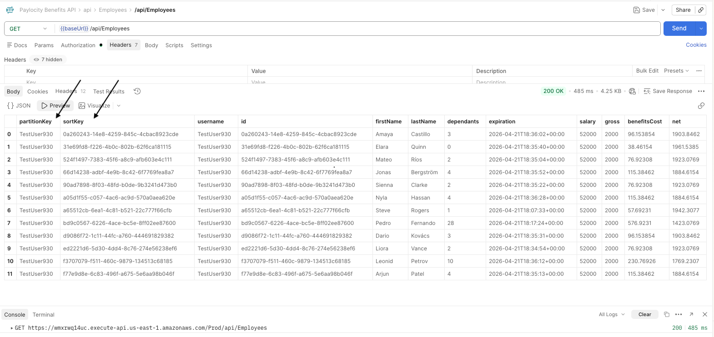
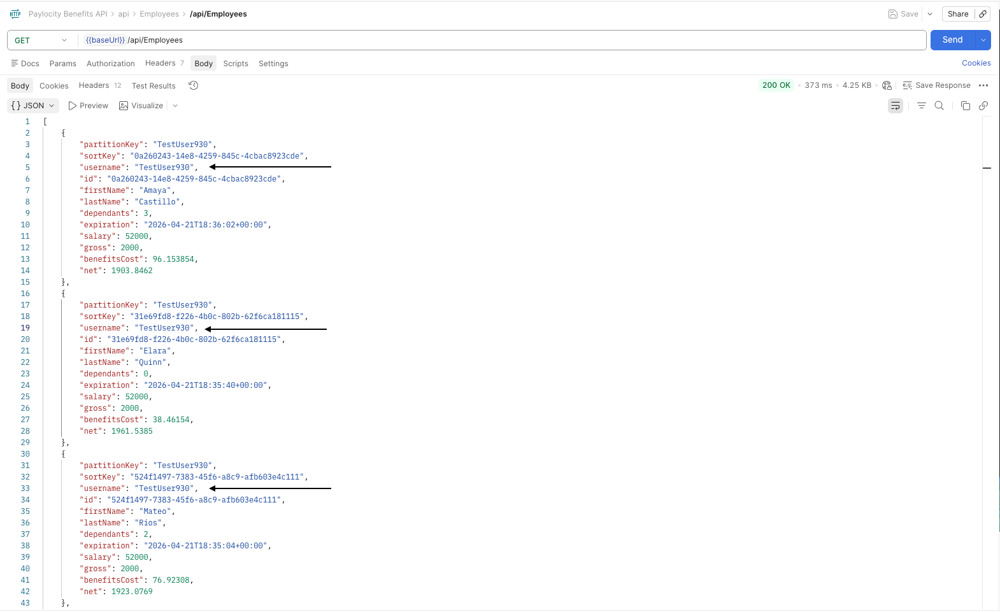

## /api/Employees

## BUG-001: Internal database fields exposed in GET /api/Employees
**Severity:** High  
**Type:** API — Information Disclosure  
**Environment:** Prod | Postman | 2026-03-21  
### Description
`partitionKey` and `sortKey` seems to be names for DB internal implementation details, they should not be visible. This could leak the infra achitecture
### Steps to Reproduce
1. Open Postman and create a new GET request
2. Set URL to: https://wmxrwq14uc.execute-api.us-east-1.amazonaws.com/Prod/api/Employees
3. Go to Headers tab and add:
   - Key: Authorization
   - Value: Basic <your_token>
4. Click Send
5. Inspect the JSON response body
### Expected Result
Response contains only business-relevant fields (id, firstName, lastName, 
dependants, salary, gross, benefitsCost, net)
### Actual Result
Response body includes undocumented internal fields:
- `partitionKey`: "TestUser930"
- `sortKey`: "0a260243-14e8-4259-845c-4cbac8923cde"
### Recommendation
Filter API response to return only business-relevant fields: 
id, firstName, lastName, dependants, salary, gross, benefitsCost, net
### Evidence
Screenshot or API response body here.


## BUG-002: `username` embedded in every record in GET /api/Employees
**Severity:** High  
**Type:** API — Information Disclosure  
**Environment:** Prod | Postman | 2026-03-21  
### Description
The GET /api/Employees endpoint returns the authenticated user's `username` 
field embedded in every single employee record. This field is not part of the 
business data model, is not displayed in the UI, and should never be part of 
an employee record payload. Exposing this creates a privacy risk and leaks 
account ownership information to anyone who can intercept or access the response.
### Steps to Reproduce
1. Open Postman and create a new GET request
2. Set URL to: https://wmxrwq14uc.execute-api.us-east-1.amazonaws.com/Prod/api/Employees
3. Go to Headers tab and add:
   - Key: `Authorization`
   - Value: `Basic <your_token>`
4. Click Send
5. Inspect any employee object in the JSON response body
6. Observe that every record contains a `username` field
### Expected Result
Employee records should contain only business-relevant fields:
`id`, `firstName`, `lastName`, `dependants`, `salary`, `gross`, 
`benefitsCost`, `net`  
The `username` field should not appear in any employee record payload.
### Actual Result
Every employee record in the response contains the `username` field 
with the authenticated account's username embedded, for example:
```json
{
  "username": "TestUser930",
  "id": "a65512cb-6ea1-4c81-b521-22c777f66cfb",
  "firstName": "Steve",
  "lastName": "Rogers",
  "dependants": 1,
  "salary": 52000,
  "gross": 2000,
  "benefitsCost": 57.69,
  "net": 1942.31
}
```
### Recommendation
Remove the `username` field from the employee serialization model.  
Authentication context should remain server-side only and never 
be embedded in resource payloads.
### Evidence
Screenshot or API response body here.


## BUG-003: Ambiguous `expiration` field exposed without business context in GET /api/Employees
**Severity:** Medium  
**Type:** API — Ambiguous Field / Potential Information Disclosure  
**Environment:** Prod | Postman | 2026-03-21  
### Description
The GET /api/Employees endpoint returns an `expiration` field in every 
employee record. While the field exists in the Swagger schema as a 
nullable date-time, it has no description, no business meaning is 
documented, and it is never displayed in the UI. 
Every record returns a timestamp approximately 30 days in the future 
from the current date, strongly suggesting this is an internal DynamoDB 
TTL (Time To Live) field used for record lifecycle management — not a 
business concept that should be exposed to API consumers.
Additionally, the field is not marked as `readOnly` in the schema, 
unlike other computed fields (`gross`, `benefitsCost`, `net`), meaning 
a client could potentially attempt to write to it — with unpredictable 
consequences.
### Steps to Reproduce
1. Open Postman and create a new GET request
2. Set URL to: https://wmxrwq14uc.execute-api.us-east-1.amazonaws.com/Prod/api/Employees
3. Go to Headers tab and add:
   - Key: `Authorization`
   - Value: `Basic <your_token>`
4. Click Send
5. Inspect any employee object in the JSON response body
6. Observe the `expiration` field and its timestamp value
7. Compare the timestamp against today's date — note it is 
   consistently ~30 days ahead across all records
### Expected Result
- If `expiration` is an internal field, it should 
  be stripped from the API response entirely
- If `expiration` is a legitimate business field, it should:
  - Have a clear description in the Swagger schema
  - Be displayed and editable in the UI
  - Be marked `readOnly` if not writable by the client
### Actual Result
Every employee record returns an `expiration` field with a future 
timestamp ~30 days ahead, with no documented business purpose:
```json
{
  "id": "a65512cb-6ea1-4c81-b521-22c777f66cfb",
  "firstName": "Steve",
  "lastName": "Rogers",
  "dependants": 1,
  "expiration": "2026-04-21T18:07:33+00:00",
  "salary": 52000,
  "gross": 2000,
  "benefitsCost": 57.69,
  "net": 1942.31
}
```
### Impact
- **Data lifecycle leak:** The ~30 day pattern strongly implies exposing internal record expiry strategy to API consumers
- **API contract ambiguity:** Undescribed fields make the contract 
  unreliable for consumers building integrations
- **UI inconsistency:** The field exists in the schema but is invisible 
  in the UI — inconsistent product behavior
### Recommendation
1. Determine internally whether `expiration` is a business or 
   infrastructure field
2. If infrastructure (TTL): remove it from the response serialization 
   layer immediately
3. If business: add a clear `description` to the Swagger schema, 
   display it in the UI, and mark it `readOnly` if not client-writable
4. Audit remaining fields for similar ambiguity
### Evidence


## BUG-004: Monetary fields returned with excessive decimal precision in GET /api/Employees
**Severity:** Medium  
**Type:** API — Data Formatting / Financial Precision  
**Environment:** Prod | Postman | 2026-03-21  
### Description
The GET /api/Employees endpoint returns monetary fields `benefitsCost` 
and `net` with excessive floating point precision (up to 6 decimal places). 
These are financial values representing dollar amounts and should always 
be returned rounded to 2 decimal places.
### Steps to Reproduce
1. Open Postman and create a new GET request
2. Set URL to: https://wmxrwq14uc.execute-api.us-east-1.amazonaws.com/Prod/api/Employees
3. Go to Headers tab and add:
   - Key: `Authorization`
   - Value: `Basic <your_token>`
4. Click Send
5. Inspect the `benefitsCost` and `net` fields in the JSON response body
6. Compare raw API values against what is displayed in the UI dashboard
### Expected Result
All monetary fields should be returned rounded to 2 decimal places, 
consistent with standard currency formatting:

| Field        | Expected  |
|--------------|-----------|
| benefitsCost | 96.15     |
| net          | 1903.85   |
| benefitsCost | 57.69     |
| net          | 1942.31   |

### Actual Result
API returns unrounded floating point values across all records:
```json
[
  {
    "firstName": "Amaya",
    "lastName": "Castillo",
    "dependants": 3,
    "benefitsCost": 96.153854,
    "net": 1903.8462
  },
  {
    "firstName": "Steve",
    "lastName": "Rogers",
    "dependants": 1,
    "benefitsCost": 57.692310,
    "net": 1942.3077
  },
  {
    "firstName": "Nyla",
    "lastName": "Hassan",
    "dependants": 4,
    "benefitsCost": 115.38462,
    "net": 1884.6154
  }
]
```
### Root Cause Analysis
The values are the result of dividing annual benefit costs by 26 paychecks 
without applying rounding:
```
Employee + 3 dependants:
Annual cost = $1000 + (3 × $500) = $2500
Per paycheck = $2500 / 26 = 96.153846153... ← never rounded

Employee + 1 dependant:
Annual cost = $1000 + (1 × $500) = $1500
Per paycheck = $1500 / 26 = 57.692307692... ← never rounded
```
The division result is stored and returned as-is instead of being 
rounded to 2 decimal places at the calculation or serialization layer.
### Impact
- **Accumulation errors:** Unrounded values used in further calculations 
  (e.g. payroll totals across many employees) will compound rounding 
  errors over time
- **Trust gap:** If a client compares API output to UI display, 
  values will not match — reducing confidence in the system
### Recommendation
Apply rounding to 2 decimal places at the **calculation layer**, 
not just the display layer:
```
benefitsCost = Math.Round(annualCost / 26, 2)
net = Math.Round(grossPay - benefitsCost, 2)
```
This ensures consistency between the API response, the UI, 
and any downstream system consuming the data.
### Evidence


## /api/Employees:id

## BUG-005: GET /api/Employees/{id} returns 500 Internal 
Server Error for incomplete UUID instead of 400 Bad Request
**Severity:** High  
**Type:** API — Error Handling / Input Validation  
**Environment:** Prod | Postman | 2026-03-21 
### Description
When a GET request is made to /api/Employees/{id} with an incomplete 
or malformed UUID, the API returns a 500 Internal Server Error instead 
of a proper 400 Bad Request. Additionally, the error response body is 
returned as raw HTML — not JSON — exposing internal application 
structure including page titles, stylesheet references, and HTML markup. 
A well-designed API should never return 500 for invalid client input, 
and should always return consistent JSON error responses regardless 
of the error type.
### Steps to Reproduce
1. Open Postman and create a new GET request
2. Set URL to: https://wmxrwq14uc.execute-api.us-east-1.amazonaws.com/Prod/api/Employees/{id}
3. Go to Headers tab and add:
   - Key: `Authorization`
   - Value: `Basic <your_token>`
4. Set Path Variable `id` to an incomplete UUID:
   - Value: `0a260243-14e8-4259-845c-` ← truncated, missing last segment
5. Click Send
6. Observe response status code and response body format
### Expected Result


## BUG-006: GET /api/Employees/{id} returns 200 OK with empty body for non-existent employee ID
**Severity:** High  
**Type:** API — Error Handling / Incorrect HTTP Status Code  
**Environment:** Prod | Postman | 2026-03-21  
### Description
When a GET request is made to /api/Employees/{id} with a valid UUID 
format that does not correspond to any existing employee record, the 
API returns 200 OK with a completely empty response body. The correct 
behavior for a resource that does not exist is 404 Not Found with a 
descriptive JSON error message. Returning 200 OK implies the request 
was successful and the resource exists — which is factually incorrect 
and misleading to any client consuming this API.
### Steps to Reproduce
1. Open Postman and create a new GET request
2. Set URL to: https://wmxrwq14uc.execute-api.us-east-1.amazonaws.com/Prod/api/Employees/{id}
3. Go to Headers tab and add:
   - Key: `Authorization`
   - Value: `Basic <your_token>`
4. Set Path Variable `id` to a valid but non-existent UUID:
   - Value: `b194f8e2-7a3c-4d65-8b0f-1e5c9a723d46`
5. Click Send
6. Observe response status code and response body
### Expected Result
The API should return 404 Not Found with a structured 
JSON error response:
```json
{
  "status": 404,
  "error": "Not Found",
  "message": "Employee with id b194f8e2-7a3c-4d65-8b0f-1e5c9a723d46 was not found"
}
```
### Actual Result
- Status: **200 OK**
- Response body: **completely empty**
- Response size: 534 B (headers only, no body content)
```
[empty body]
```
### Impact
- **Incorrect success signal:** Any client receiving 200 OK 
  will assume the employee exists and attempt to process 
  an empty response — causing silent failures or 
  null reference errors downstream
- **Client error handling broken:** Clients checking for 
  404 to detect missing resources will never trigger 
  their not-found logic since 200 is always returned
- **Monitoring gap:** Server logs will show 200 OK for 
  requests about non-existent resources — making it 
  impossible to detect data access issues or 
  unauthorized enumeration attempts
- **REST contract violation:** HTTP 200 OK semantically 
  means "the resource was found and here it is" — 
  returning it for a missing resource violates the 
  REST standard
- **Resource enumeration risk:** An attacker can silently 
  probe for valid UUIDs — a 200 with empty body vs 
  200 with data is the only difference, making 
  enumeration harder to detect
### Recommendation
1. Return **404 Not Found** when a requested resource 
   does not exist
2. Always return a consistent JSON error body:
```json
{
  "status": 404,
  "error": "Not Found",
  "message": "Employee with id {id} was not found"
}
```
3. Audit DELETE and PUT endpoints for the same 
   missing 404 handling on non-existent IDs
4. Ensure response body is never empty — always 
   return a JSON response regardless of outcome
### Evidence


## BUG-007: GET /api/Employees/{id} returns 500 Internal Server Error when id is empty
**Severity:** High  
**Type:** API — Error Handling 
**Environment:** Prod | Postman | 2026-03-21  
### Description
When a GET request is made to /api/Employees/{id} with an empty 
path variable, the API crashes and returns a 500 Internal Server 
Error. The API should validate that the `id` path parameter is present and non-empty before 
attempting any processing, returning a 400 Bad Request immediately.
### Steps to Reproduce
1. Open Postman and create a new GET request
2. Set URL to: https://wmxrwq14uc.execute-api.us-east-1.amazonaws.com/Prod/api/Employees/{id}
3. Go to Headers tab and add:
   - Key: `Authorization`
   - Value: `Basic <your_token>`
4. Set Path Variable `id` to completely empty:
   - Key: `id`
   - Value: `` ← empty, no value provided
5. Click Send
6. Observe response status code, response time, and body
### Expected Result
The API should catch the missing path parameter immediately 
and return a structured JSON 400 Bad Request:
```json
{
  "status": 400,
  "error": "Bad Request",
  "message": "Path parameter 'id' is required and cannot be empty"
}
```
Response should be fast (under 50ms) since no DB call 
should be made for an empty input.
### Actual Result
- Status: **500 Internal Server Error**
### Impact
- **Application crash:** Empty input causes an unhandled 
  server exception — the server should never crash 
  on missing client input
### Recommendation
1. Add a validation layer at the API boundary for ALL 
   path parameters before any processing:
```
if (id == null || id.isEmpty()) return 400 Bad Request
if (!isValidUUID(id)) return 400 Bad Request
if (!existsInDB(id)) return 404 Not Found
```
2. Ensure the validation layer short-circuits immediately — 
   no DB calls should be made for invalid inputs
4. Apply the same validation pattern to DELETE /{id} 
   and GET /{id} consistently
5. Audit all path parameters across all endpoints 
   for the same missing validation
### Evidence
